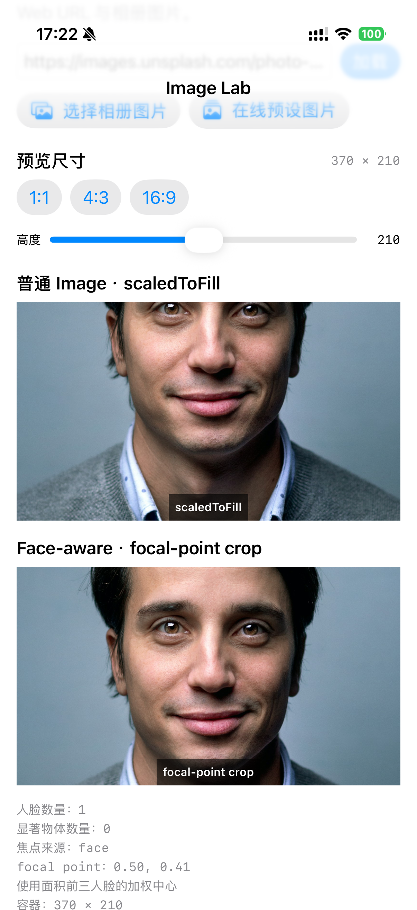
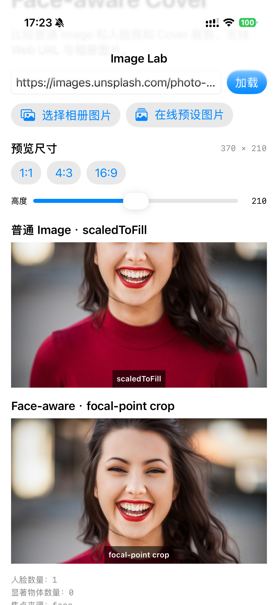

# FaceAwareImageKit

[简体中文](README.zh-CN.md) | **English**

> Aspect-fill SwiftUI images that always frame the face.

FaceAwareImageKit loads remote images, runs on-device Vision analysis to locate faces and salient objects, and renders the result so the focal point stays in view — even when the layout aspect ratio would otherwise crop it out.

- ✅ Pure SwiftUI views (`FaceAwareImage`, `FaceAwareAsyncImage`).
- ✅ Async/await pipeline with request deduplication and generation-based cancellation.
- ✅ HTTP and decoded image caches, both bounded.
- ✅ `actor`-isolated client safe to share across views.
- ✅ iOS 15+, macOS 13+, visionOS 1+. Zero third-party dependencies.

## Requirements

| Platform | Minimum Version |
|----------|-----------------|
| iOS      | 15.0            |
| iPadOS   | 15.0            |
| macOS    | 13.0            |
| visionOS | 1.0             |

Swift 5.9 / Xcode 15 or later.

## Installation

### Swift Package Manager

```swift
// Package.swift
dependencies: [
    .package(url: "https://github.com/<your-org>/FaceAwareImageKit.git", from: "1.0.0"),
],
targets: [
    .target(
        name: "YourApp",
        dependencies: [
            .product(name: "FaceAwareImageKit", package: "FaceAwareImageKit"),
        ]
    ),
]
```

Or add **File → Add Packages…** in Xcode and paste the repository URL.

## Quick start

```swift
import FaceAwareImageKit
import SwiftUI

struct AvatarView: View {
    let url: URL

    var body: some View {
        FaceAwareAsyncImage(url: url)
            .frame(width: 96, height: 96)
            .clipShape(Circle())
    }
}
```

For pre-decoded resources or custom phases:

```swift
FaceAwareImage(resource: resource)            // resource: FaceAwareImageResource
FaceAwareAsyncImage(url: url) { phase in       // phase: FaceAwareImagePhase
    switch phase {
    case .empty:        ProgressView()
    case .progress(let p): ProgressView(value: p)
    case .success(let res, let frame): res.image.resizable().aspectRatio(contentMode: .fill)
    case .failure:      Image(systemName: "photo")
    }
}
```

## Example

The included Image Lab demo compares standard `scaledToFill` rendering with a face-aware focal-point crop. The face-aware result keeps the subject visible when the image is cropped to the same aspect ratio.

<p align="center">
  
  
</p>

## Configuration

Construct a client once at app launch and pass it to views — never inside `body`.

```swift
let client = FaceAwareImageClient(configuration: .init(
    memoryCacheBytesLimit: 32 * 1024 * 1024,
    preferredImageDimension: 1024,
))

FaceAwareAsyncImage(url: avatarURL, client: client)
```

## Demo app

The repo includes a SwiftUI demo under `Examples/FaceAwareImageLab`. Generate the Xcode project with:

```bash
cd Examples
xcodegen generate
open FaceAwareImageKitExamples.xcodeproj
```

## Documentation

DocC documentation is bundled in `Sources/FaceAwareImageKit/Documentation.docc`. Build it locally with:

```bash
swift build
xcrun docc preview --path .build/debug/FaceAwareImageKit.docc
```

## License

MIT — see [`LICENSE`](LICENSE).

## Contributing

Issues and pull requests welcome. Please run `swift test` and `swift build` before submitting.
